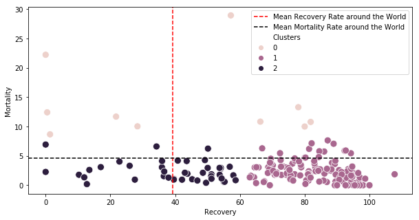
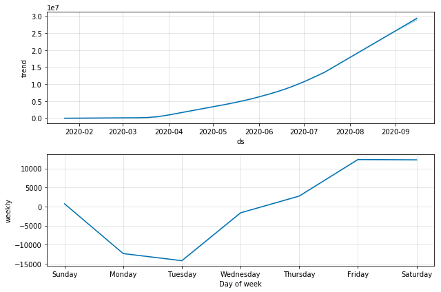

# COVID-19-Forecasting-Visualization-prediction
Objective

This project aims to analyze the COVID-19 pandemic through a series of basic visualization techniques. It includes a comparative study of China, where the virus originated, against the rest of the world, as well as predictions and time-series forecasting to understand the potential spread and impact of the virus in the coming days.

Dataset Overview

The data, originally made available by Johns Hopkins University, is compiled into a time-series format detailing daily updates on the pandemic's progression since January 22, 2020. This dataset includes the cumulative number of confirmed cases, deaths, and recoveries across various global locations.
Column Description

The main file covid_19_data.csv includes the following columns:

    Sno - Serial number
    ObservationDate - Date of the observation in MM/DD/YYYY
    Province/State - Specific province or state of observation
    Country/Region - Country of observation
    Last Update - Time of the last update in UTC
    Confirmed - Cumulative number of confirmed cases up to the date
    Deaths - Cumulative number of deaths up to the date
    Recovered - Cumulative number of recoveries up to the date

Additional datasets for individual-level information and country-specific data are also mentioned, with respective sources for detailed study and analysis.

## Overview

The repository contains a Jupyter notebook which is designed to:

    Visualize the spread of the COVID-19 virus globally.
    Compare the trajectory of the virus in China compared to other countries.
    Use statistical and machine learning models to predict future cases.
    Perform time-series analysis to forecast the pandemic's progression.

Data Source

The data used in this study is sourced from reputable organizations tracking the outbreak, ensuring that the visualizations and predictions are based on accurate and up-to-date information.
Getting Started

To run this notebook:

    Clone the repository.
    Ensure that you have Jupyter Notebook installed.
    Install the required dependencies listed in the requirements.txt file.
    Launch Jupyter Notebook and open the .ipynb file to view the analysis.

